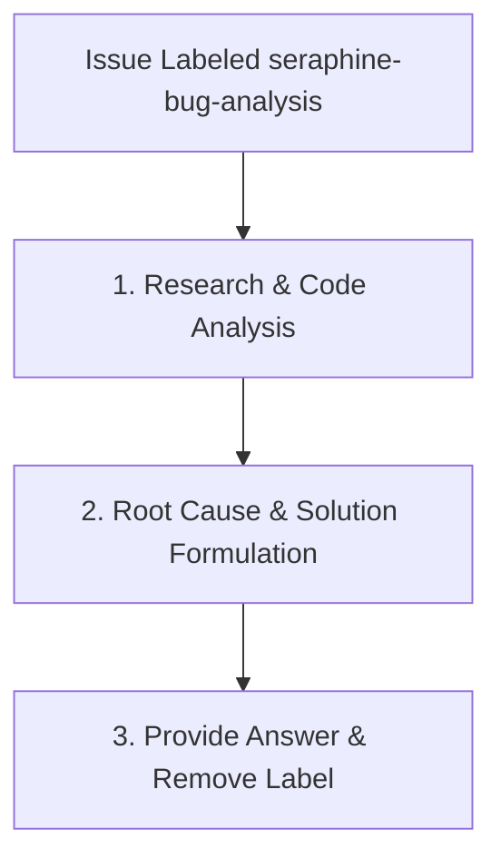

# 🔬 The `seraphine-bug-analysis` Label Workflow

When a GitHub issue is labeled with `seraphine-bug-analysis`, the AI assistant (**Seraphine**) is triggered to deeply investigate the reported issue, perform code analysis, and provide a comprehensive answer to the user's questions about the bug.

## 🔄 Workflow Lifecycle

---

## 📋 Phase Guidelines

### 1. Research & Code Analysis
The agent's primary goal in this phase is to thoroughly understand the bug and the surrounding context.
* **Code Trace:** Deeply analyze the codebase to trace the issue to specific files, functions, and lines of code.
* **Intended vs. Actual Behavior:** Identify the gap between the expected behavior described in the issue and the actual behavior of the code.
* **Sandbox Verification:** (Optional) If necessary, run tests or small snippets to confirm hypotheses, but do not commit any changes.

### 2. Root Cause & Solution Formulation
Once the code has been analyzed, formulate a complete and structured answer.
* **Root Cause Analysis:** Clearly define the step-by-step root cause of the bug.
* **Implementation Plan:** Suggest a potential implementation plan or include code snippets illustrating how the bug could be fixed.
* **Not a Bug:** If the agent determines that the reported "bug" is actually the intended behavior, explain the intended behavior clearly. Leave the issue open for the user to decide whether to update requirements or close the issue.

### 3. Provide Answer & Remove Label
The final output of this workflow is a detailed response.
* **Post Comment:** Post a detailed comment on the GitHub issue containing the full analysis, root cause, and proposed solutions or explanations. Do not create a pull request or write a separate markdown artifact file.
* **Label Management:** After successfully posting the answer, remove the `seraphine-bug-analysis` label from the issue to indicate that the analysis is complete.
