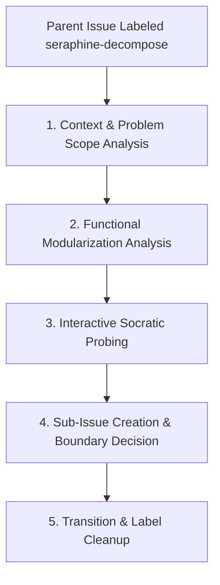

# 🧩 The `seraphine-decompose` Label Workflow

When a broad or complex parent issue is labeled with `seraphine-decompose`, the AI assistant (**Seraphine**) is triggered to execute a 5-phase lifecycle to decompose the problem into functional modules before requirements gathering begins.

## 🔄 Workflow Lifecycle



---

## 📋 Phase Guidelines

### 1. Context & Problem Scope Analysis
The agent reads the parent issue description, comments, and preceding context to thoroughly understand the high-level problem scope, functional requirements, and overall business goals.

### 2. Functional Modularization Analysis
The agent analyzes the high-level requirements to identify logical functional domain boundaries and module isolation.
* **Domain Focus:** Focus strictly on functional domain boundaries and user-facing/system capability slices, avoiding premature technical design or implementation details.
* **Module Isolation:** Ensure each proposed module is decoupled and represents a self-contained functional area.

### 3. Interactive Socratic Probing (`/grill-me`)
If the parent issue is vague, incomplete, or contains ambiguous functional scope:
* Engage in targeted clarifying questions focusing on functional boundaries.
* Ask concise questions one at a time using the `/grill-me` approach to resolve design decisions and align with stakeholder intent.

### 4. Sub-Issue Creation & Boundary Decision
Once functional boundaries are established:
1. **Proposal Comment:** Post a structured breakdown proposal as a comment on the parent issue outlining the functional sub-modules.
2. **Sub-Issue Creation:** Programmatically create native GitHub sub-issues under the parent issue using the `gh` CLI:
   ```bash
   gh issue create --parent <parent-number> --title "[Sub-Issue] <Module Title>" --body "<Context & Module Scope>" --assignee brotherlogic-automation --label <label>
   ```
3. **Boundary Decision:** Dynamically select the label for each generated sub-issue based on complexity:
   * **Discrete Module:** Assign `seraphine-needs-requirements` if the module scope is clearly bounded and ready for formal requirements gathering.
   * **Complex Module:** Assign `seraphine-decompose` if the sub-module itself is too broad and requires further functional decomposition.

### 5. Transition & Label Cleanup
Once all sub-issues have been created:
* Remove the `seraphine-decompose` label from the parent issue:
  ```bash
  gh issue edit <parent-number> --remove-label seraphine-decompose
  ```
* Keep the parent issue open to serve as the parent container tracking overall progress across sub-modules.
