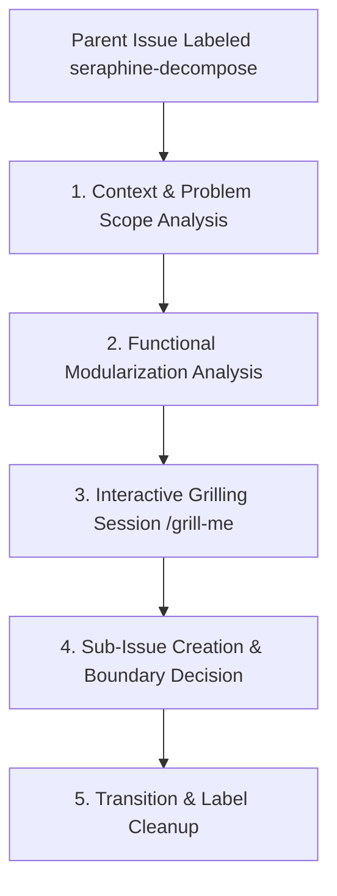

# 🧩 The `seraphine-decompose` Label Workflow

When a broad or complex parent issue is labeled with `seraphine-decompose`, the AI assistant (**Seraphine**) is triggered to execute a 5-phase lifecycle to decompose the problem into functional modules before requirements gathering begins.

## 🔄 Workflow Lifecycle



---

## 📋 Phase Guidelines

### 1. Context & Problem Scope Analysis
The agent reads the parent issue description, comments, and preceding context to thoroughly understand the high-level problem scope, functional requirements, and overall business goals.

### 2. Functional Modularization Analysis
The agent analyzes the high-level requirements to formulate a preliminary functional decomposition draft identifying logical functional domain boundaries and module isolation.
* **Domain Focus:** Focus strictly on functional domain boundaries and user-facing/system capability slices, avoiding premature technical design or implementation details.
* **Module Isolation:** Ensure each proposed module is decoupled and represents a self-contained functional area.
* **Preliminary Draft:** Prepare the proposed module breakdown internally as the basis for the subsequent grilling session.

### 3. Interactive Grilling Session (`/grill-me`)
Seraphine initiates a mandatory grilling session with the developer/user to stress-test the preliminary functional decomposition, surface unstated assumptions, identify missing scope, and resolve functional boundaries before any sub-issues are generated.
* **Precondition & Context:** Ensure thorough understanding of the parent issue, preceding discussions, and the codebase context prior to starting the session.
* **Execution Rules (adhering to `/grill-me` skill):**
  - **Single Question Focus:** Ask exactly one targeted question at a time. Do not group or batch multiple questions into a single turn.
  - **Provide Recommendations:** For every question asked, provide recommended answers or explicit options to steer towards concrete decisions.
  - **Codebase First:** If an answer can be confirmed by exploring the codebase, investigate directly rather than querying the user.
  - **Gating Rule:** Do not create sub-issues or post finalized breakdown comments until all grilling questions have been resolved and a shared understanding is reached.
* **Mandatory Probing Areas:**
  1. **Functional Module Boundaries & Decoupling:** Are the module boundaries clearly separated by domain responsibility and capability slices without leaking technical implementation details? Are responsibilities decoupled?
  2. **Full Scope Coverage & Completeness:** Do the proposed modules comprehensively address all goals, user stories, and acceptance criteria from the parent issue? Is out-of-scope functionality explicitly excluded?
  3. **Granularity & Sizing Decisions:** Is each module appropriately sized? Should it be marked as discrete (`seraphine-needs-requirements`) or does it require recursive functional breakdown (`seraphine-decompose`)?
  4. **Inter-Module Sequencing & Dependencies:** Are there functional prerequisites, logical orderings, or data flow dependencies between the modules?

### 4. Sub-Issue Creation & Boundary Decision
Once the grilling session concludes with a shared understanding:
1. **Proposal Comment:** Post the finalized, structured breakdown proposal as a comment on the parent issue outlining the functional sub-modules, their boundaries, and any dependencies.
2. **Sub-Issue Creation:** Programmatically create native GitHub sub-issues under the parent issue using the `gh` CLI:
   ```bash
   gh issue create --parent <parent-number> --title "[Sub-Issue] <Module Title>" --body "<Context & Module Scope>" --assignee brotherlogic-automation --label <label>
   ```
3. **Boundary Decision:** Dynamically select the label for each generated sub-issue based on complexity:
   * **Discrete Module:** Assign `seraphine-needs-requirements` if the module scope is clearly bounded and ready for formal requirements gathering.
   * **Complex Module:** Assign `seraphine-decompose` if the sub-module itself is too broad and requires further functional decomposition.

### 5. Transition & Label Cleanup
Once all sub-issues have been created:
* Remove the `seraphine-decompose` label from the parent issue:
  ```bash
  gh issue edit <parent-number> --remove-label seraphine-decompose
  ```
* Keep the parent issue open to serve as the parent container tracking overall progress across sub-modules.
