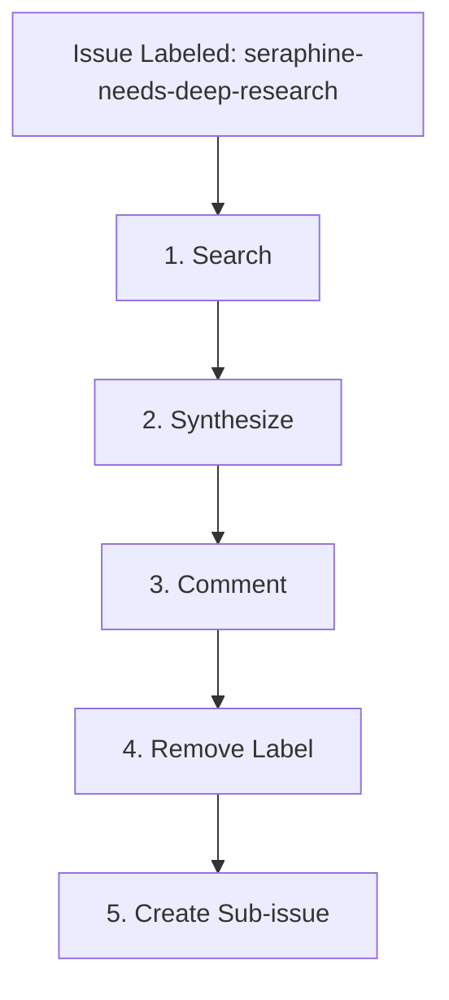

# 🔍 The `seraphine-needs-deep-research` Label Workflow

When an issue is labeled with `seraphine-needs-deep-research`, the AI assistant is triggered to perform comprehensive research to explore viable solutions for the problem space.

## 🔄 Workflow Lifecycle

## 📋 Phase Guidelines

### 1. Search
The agent must invoke the `deep-research` skill to thoroughly evaluate the problem space.
* **Objective**: Identify at least the top 3 viable options or approaches to solving the issue.
* **Process**: Gather information, read relevant documentation, and explore potential solutions without strictly adhering to a specific formatting template for pros and cons. The focus is on organic exploration.

### 2. Synthesize
Once the top viable options (at least 3) are identified, the agent must synthesize the findings.
* **Output Generation**: Create an organic, well-structured summary of the research.
* **Content**: The summary should detail the viable options, outlining the pros and cons of each in a clear and understandable manner.

### 3. Comment
Post the synthesized research summary as a comment on the parent issue.
* **Action**: Ensure the comment captures the nuances of the explored options to aid in subsequent decision-making.

### 4. Remove Label
After successfully posting the research summary comment, remove the `seraphine-needs-deep-research` label from the issue to indicate the completion of the deep research phase.

### 5. Create Sub-issue
Create a new child sub-issue to initiate the next phase of the workflow.
* **Action**: Create a `[Requirements]` sub-issue using the GitHub API.
* **Label**: Apply the `seraphine-needs-requirements` label to this new sub-issue.

---

## ⚠️ Error States & Edge Cases

The agent must handle the following error states gracefully:

### 1. No Viable Options Found
* **Condition**: If the search phase yields fewer than the necessary viable options or no feasible approaches exist.
* **Action**: 
  * Document the findings and the specific reasons why viable options could not be identified.
  * Post this explanation as a comment on the issue.
  * Remove the `seraphine-needs-deep-research` label.
  * Do **not** proceed to create the requirements sub-issue.

### 2. Ambiguous Problem Space
* **Condition**: If the issue description is too vague, ambiguous, or lacks sufficient detail to conduct meaningful research.
* **Action**:
  * Halt the research process.
  * Post a comment asking the author for specific clarifications or additional context.
  * Do **not** remove the `seraphine-needs-deep-research` label until the ambiguity is resolved and research can proceed.
