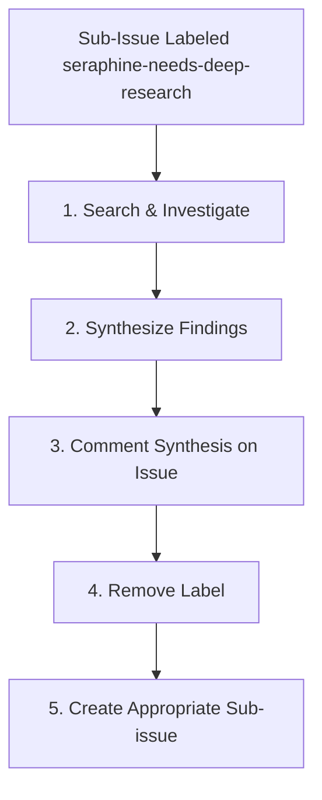

# 🔍 The `seraphine-needs-deep-research` Label Workflow

When an issue is labeled with `seraphine-needs-deep-research`, the AI assistant is triggered to execute a deep research and investigation process to gather required context, evaluate options, and provide a detailed synthesis.

## 🔄 Workflow Lifecycle

---

## 📋 Phase Guidelines

### 1. Search & Investigate
The agent must use its web search, code search, or other exploration tools to extensively investigate the problem.
* Identify potential approaches, tools, or architectural decisions.
* Gather data from documentation, forums, or deep within the codebase.

### 2. Synthesize Findings
Once sufficient information is collected, synthesize the findings into a clear, concise report.
* Compare trade-offs between different approaches.
* Make concrete recommendations based on the gathered data.

### 3. Comment Synthesis on Issue
Publish the final synthesis as a comment on the original issue. This ensures there is a persistent record of the research for the user or subsequent agents.
* The comment should be structured and easy to read.

### 4. Remove Label
After commenting, immediately remove the `seraphine-needs-deep-research` label from the issue to prevent duplicate processing.

### 5. Create Sub-issue
Based on the synthesis, transition the work to the next phase by creating an appropriate sub-issue or labeling the parent issue accordingly (e.g., triggering `seraphine-needs-implementation-plan` or `seraphine-ready-to-implement`).
* If clear steps forward are identified, outline them in the new issue.

---

## 🚨 Error States and Handling

During the research process, the agent may encounter roadblocks. Handle them as follows:

### "No Viable Options Found"
* **Definition:** The agent has searched extensively but cannot find any technically feasible solution or required documentation to solve the problem.
* **Action:** Comment on the issue detailing exactly what was searched and why the paths are unviable. Remove the `seraphine-needs-deep-research` label. Tag the user for manual intervention or pivot the requirements.

### "Ambiguous Problem Space"
* **Definition:** The research reveals that the problem is too broad or there are too many conflicting paths, making it impossible to confidently recommend a single approach.
* **Action:** Comment on the issue summarizing the conflicting paths and the specific questions that need clarification from the user. Remove the `seraphine-needs-deep-research` label. Add the `seraphine-needs-requirements` label to force a requirements gathering phase.
