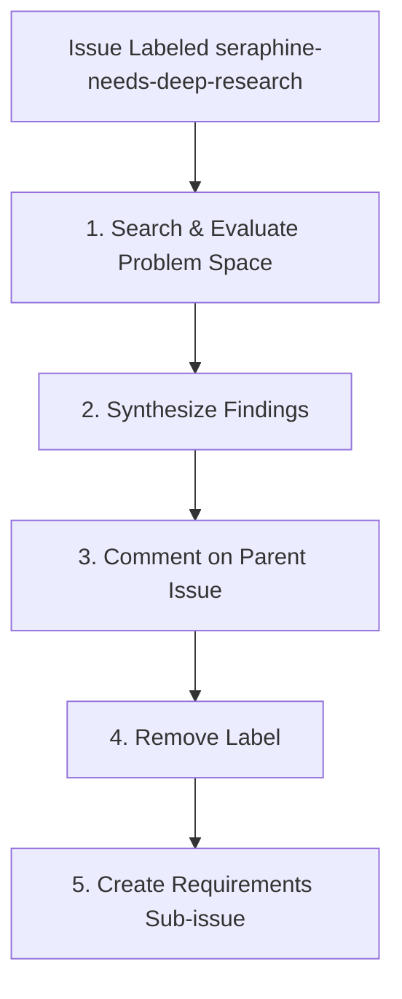

# 🏷️ The `seraphine-needs-deep-research` Label Workflow

When a GitHub issue is labeled with `seraphine-needs-deep-research`, the AI assistant (**Seraphine**) is triggered to execute a deep research process. This stage leverages a specialized `deep-research` skill to explore the problem space, evaluate potential solutions, and synthesize findings before moving to requirements gathering.

## 🔄 Workflow Lifecycle

---

## 📋 Phase Guidelines

### 1. Search & Evaluate Problem Space
The agent must proactively research and evaluate the problem space defined in the issue using the `deep-research` skill.
* **Action:** Invoke the `deep-research` skill to explore the problem.
* **Sufficiency Threshold:** You must stop researching once you have identified at least the top **3 viable options**.
* **Organic Evaluation:** Evaluate the pros and cons of these options organically.

### 2. Synthesize Findings
Once the research phase hits the sufficiency threshold, consolidate the information.
* **Format:** There is no strict formatting template required. Present the pros, cons, and tradeoffs of the viable options in a clear, organic summary that best fits the nature of the research.

### 3. Comment on Parent Issue
The synthesized findings must be documented back to the user.
* **Action:** Post the organic summary as a comment directly on the parent GitHub issue.

### 4. Remove Label
Once the research is published to the issue, update the issue state.
* **Action:** Remove the `seraphine-needs-deep-research` label from the parent issue to signify the completion of the research phase.

### 5. Create Requirements Sub-issue
Transition the workflow to the next phase by creating a new sub-issue.
* **Action:** Programmatically create a GitHub sub-issue for requirements gathering.
   - **Sub-Issue Title:** `[Requirements] <Parent Issue Title>`
   - **Sub-Issue Label:** `seraphine-needs-requirements`
   - **Sub-Issue Description:** A brief description referencing the parent issue and the research findings, instructing the agent to begin the requirements-gathering process.

---

## ⚠️ Error States & Handling

Explicitly handle the following error states during the research phase:

* **No Viable Options Found:**
  - If exhaustive search yields no viable options, document the search paths taken and explain why no options are feasible. Post this explanation as a comment, remove the label, and create a `seraphine-needs-requirements` sub-issue outlining the blocker so it can be resolved during requirements gathering.

* **Ambiguous Problem Space:**
  - If the initial problem statement is too vague to yield meaningful research results, immediately stop. Post a comment detailing the ambiguity, remove the `seraphine-needs-deep-research` label, and create a `seraphine-needs-requirements` sub-issue to clarify the scope before any further technical deep dive.
