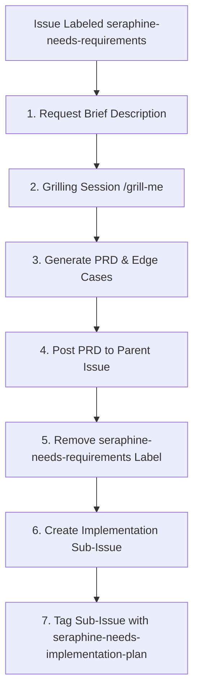
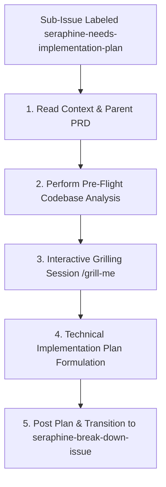
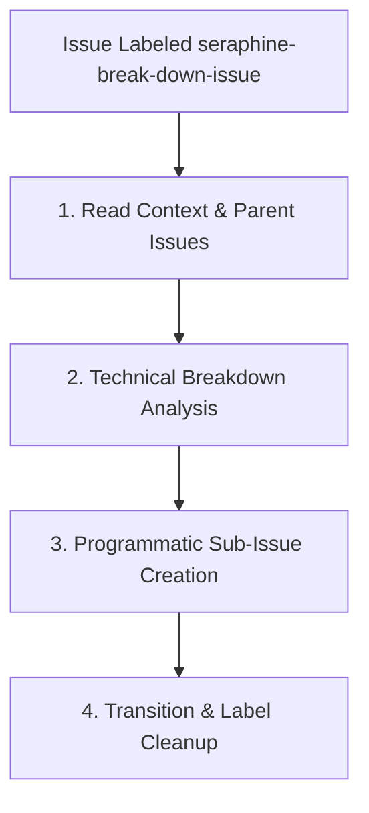
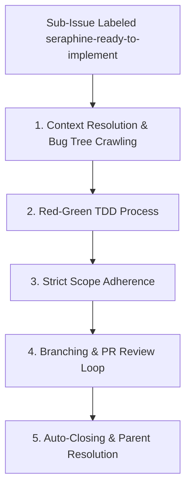

# Notes Management System - GitHub Issue Processing Workflow

This document defines the official workflow and guidelines for collaborating on GitHub issues. It ensures that all features and fixes undergo a structured, quality-controlled lifecycle from requirements gathering to execution.

---

## 🏷️ The `seraphine-needs-requirements` Label Workflow

When a GitHub issue is labeled with `seraphine-needs-requirements`, the AI assistant (**Seraphine**) is triggered to run a requirements-gathering process. This stage focuses strictly on **what** needs to be built and **why**, avoiding any early technical implementation details.

### 🔄 Workflow Lifecycle

---

### 📋 Phase Guidelines

#### 1. Request Brief Description
Before starting any structured analysis, the agent must ask the developer/user to briefly describe the issue in their own words. This provides critical initial context and grounds the subsequent questions in the user's intent.
* **Action:** Post a concise response asking the user for a high-level summary and goals of the issue.

#### 2. Interactive Grilling Session (`/grill-me`)
Once the initial description is provided, the agent initiates a focused grilling session using the `/grill-me` command or an interactive interview format.
* **Objective:** Uncover ambiguities, capture user stories, and map out requirements.
* **Rule:** The questions must probe **only the requirements** of the issue. Do not discuss specific technologies, database schemas, API designs, or code architectures yet.
* **Probing Areas:**
  - Who is the end-user, and what is their primary flow?
  - What are the success criteria?
  - What are the functional boundaries (what is explicitly *in* scope vs. *out* of scope)?
  - What inputs are required, and what outputs are expected?

#### 3. PRD & Edge Case Formulation
The outcome of the grilling session is compiled into a clear **Product Requirements Document (PRD)** type specification.
* **Format:** The PRD must be highly structured and contain:
  1. **Executive Summary / Goal**: The core value proposition of the issue.
  2. **User Stories**: Real-world scenarios (e.g., *"As a user, I want to..."*).
  3. **Functional Requirements**: Bulleted, actionable, and testable items.
  4. **Out of Scope**: Boundaries to prevent scope creep.
  5. **Edge Cases & Error States**: Explicit definitions of system behavior under unexpected inputs or failures.

> [!TIP]
> Ensure edge cases are exhaustive. Think about connection dropouts, empty states, limits on input lengths, and concurrent modifications.

#### 4. GitHub Issue Synchronization & Sub-Issue Creation
Once the PRD is complete, the agent must execute the following automated steps on GitHub:
1. **Post the PRD:** Render the requirements document beautifully as a comment on the parent GitHub issue.
2. **Remove the Label:** Remove the `seraphine-needs-requirements` label from the parent issue to signify completion of the requirements phase.
3. **Create Sub-Issue:** Programmatically create a GitHub sub-issue to track the subsequent step:
   - **Sub-Issue Title:** `[Implementation Plan] <Parent Issue Title>`
   - **Sub-Issue Label:** `seraphine-needs-implementation-plan`
   - **Sub-Issue Description:** A link referencing the parent issue and instructing the agent to begin drafting the implementation plan.

---

## 🛠️ The `seraphine-needs-implementation-plan` Label Workflow

When a sub-issue is labeled with `seraphine-needs-implementation-plan`, the AI assistant (**Seraphine**) is triggered to formulate a concrete, technical design and step-by-step implementation blueprint before any code changes are made.

### 🔄 Workflow Lifecycle

---

### 📋 Phase Guidelines

#### 1. Read Context & Parent PRD
Seraphine reads the sub-issue description, extracts the reference link to the parent issue, and retrieves the approved Product Requirements Document (PRD) posted as a comment on the parent issue. This grounds all architectural decisions in the defined scope and user requirements.

#### 2. Perform Pre-Flight Codebase Analysis
Before asking any grilling questions, Seraphine must perform a comprehensive scan of the codebase to gain a complete understanding of relevant schemas, services, packages, and UI files.
* **Scan Areas:**
  - Protocol Buffers: Files under `/proto/` that define the data model.
  - Backend: Directory structure and Go code under `/internal/` and `/cmd/`.
  - Frontend: React components and styles under `/frontend/src/`.
* **Action:** Present a concise summary of the "Pre-Flight Analysis" to the user, highlighting existing structures that will be affected by the plan.

#### 3. Interactive Grilling Session (`/grill-me`)
Seraphine initiates a technical grilling session with the developer/user. The session proceeds Socratically—**asking exactly one highly targeted question at a time**—and suggests sensible, best-practice defaults to resolve technical design ambiguities.
* **Mandatory Probing Areas:**
  1. **Data Persistence & Schema:** Do we need new `.proto` messages/fields, or changes to how data is serialized and stored via `pstore`?
  2. **API Boundaries & gRPC Contracts:** Are new gRPC service definitions, RPC methods, or custom request/response models needed?
  3. **Backend Logic & Concurrency:** What Go packages and logic are affected? Are there concurrency considerations (contexts, channels, waitgroups)?
  4. **Frontend Architecture:** Which React components, custom hooks, or routes are affected? How should responsiveness and the premium styling system be applied?
  5. **Security & Auth:** Are there authentication, permission, or GitHub OAuth implications?
  6. **Error Handling & Fault Tolerance:** How do both frontend and backend handle offline states, network latency, API failures, or corrupt inputs?

#### 4. Technical Implementation Plan Formulation
Once a shared understanding of technical details is reached, Seraphine compiles the blueprint.
* **Format:** The Implementation Plan must adhere to **Option A** structure:
  1. **Proposed Architecture / System Design:** A high-level overview of backend and frontend components.
  2. **Schema & Protocol Buffer Changes:** Specific `.proto` modifications (field numbers, types, message structures).
  3. **Backend (Go) Implementation Details:** File paths, package design, gRPC server methods, storage wrapper functions, and logic modifications.
  4. **Frontend (React) Implementation Details:** Component names, hook usage, routes, CSS design tokens, and styling updates.
  5. **Testing Strategy:** Plan for backend Go tests (`go test -v ./...`), integration verifications, and manual frontend testing steps.

#### 5. Post Plan & Update Labels
Seraphine posts the finalized implementation plan to the sub-issue using premium markdown formatting (collapsible `
` blocks, interactive task lists `- [ ]`, Mermaid diagrams, and direct file path links).
* **Action:**
  1. Remove the `seraphine-needs-implementation-plan` label.
  2. Add the `seraphine-break-down-issue` label to the sub-issue.

---

## 🛠️ The `seraphine-break-down-issue` Label Workflow

When an issue (typically the `[Implementation Plan]` sub-issue) is labeled with `seraphine-break-down-issue`, the AI assistant (**Seraphine**) is triggered to break the technical implementation plan down into highly granular, junior-engineer-friendly component issues.

### 🔄 Workflow Lifecycle

---

### 📋 Phase Guidelines

#### 1. Read Context & Parent Issues
The agent must read the description/body of the current issue and extract any referenced parent issue numbers (e.g., `#123` or direct links) to fetch all comments, the approved Product Requirements Document (PRD), and preceding technical discussions. This ensures the full historical context is captured before breaking down tasks.

#### 2. Technical Breakdown Analysis
Seraphine analyzes the technical implementation plan proposed in the current issue to isolate discrete work items.
* **Granularity Goal:** Design tasks that are easily reviewable and can be completed in a single code change.
* **Component Boundaries:** Each sub-issue must target a single, isolated slice of the technology stack. For example:
  - Just the backend Protocol Buffer definition and `pstore` serialization layer.
  - Just the Go gRPC service handler or sync loop logic.
  - Just a specific frontend React component, route, or styling layout.
* **Self-Contained Verification:** Each component must be capable of being coded and tested in isolation (e.g., has its own unit tests, mock data, or visual validation).
* **Dependency Identification:** Explicitly identify dependencies between component tasks. If task X is dependent on task Y being completed first, this sequence must be highlighted.

#### 3. Programmatic Sub-Issue Creation
For each identified component, Seraphine programmatically files a new GitHub sub-issue under the current issue.
* **Sub-Issue Title:** Must use the format `[Sub-Issue] <Action>` (e.g., `[Sub-Issue] Implement pstore serialization for note status`).
* **Sub-Issue Body:** Sub-issues should stand alone and do not need to include the parent implementation plan. Context can be picked up from the bug tree when needed. **Explicitly state issue dependencies in the description: if sub-issue X is dependent on sub-issue Y, this relationship must be clearly documented.**
* **Sub-Issue Label:** Must be marked with the `seraphine-ready-to-implement` label.

#### 4. Transition & Label Cleanup
Once all component sub-issues are successfully filed:
* **Remove the Label:** Remove the `seraphine-break-down-issue` label from the current issue.
* **Keep Issue Open:** Do **not** close the current issue. Keep it open to serve as the overarching coordination point for the child tasks.

---

## 🛠️ The `seraphine-ready-to-implement` Label Workflow

When a granular child sub-issue is labeled with `seraphine-ready-to-implement`, the AI assistant is triggered to execute a disciplined engineering process to implement the specified component slice.

### 🔄 Workflow Lifecycle

---

### 📋 Phase Guidelines

#### 1. Context Resolution & Bug Tree Crawling
Before writing any code, the agent must pull in all necessary context from the bug tree to understand where the task fits into the broader implementation.
* **Action:** Programmatically query GitHub using the `gh` CLI (e.g., executing `gh issue view <parent_id>`) to traverse up the issue hierarchy, locate the parent implementation plan, and reference the original approved Product Requirements Document (PRD).

#### 2. Red-Green TDD Process
Follow a strict Test-Driven Development (TDD) cycle to ensure absolute correctness:
1. **Write Red Tests:** Write the new unit test(s) first. Run the test command (e.g., `go test -v ./...` or `npm run test`) and output the failing ("Red") terminal logs directly in the chat to prove the test is failing.
2. **Implement Green Code:** Write the implementation code. Run the tests again and verify that they pass cleanly ("Green").

#### 3. Strict Scope Adherence
* **Rule:** The agent must only work on the specific component described in the sub-issue. Avoid any unrelated refactoring or feature additions to prevent scope creep.

#### 4. Branching & PR Review Loop
1. Create a dedicated feature branch for the task. Ensure that at least one of your pushed commits includes the `Closes #<ISSUE_NUMBER>` (or `Resolves #<ISSUE_NUMBER>`) stanza in the commit message.
2. The repository CI/CD pipeline/PR builder will automatically extract this closing stanza and include it in the generated Pull Request description.
3. Review status in a loop to address any reviews, comments, or build failures on the PR until all comments are resolved.

#### 5. Auto-Closing & Parent Resolution
* **Auto-Close:** Do NOT close the sub-issue manually. The CI/CD pipeline will automatically close the issue once the PR is merged, relying on the `Closes #<ISSUE_NUMBER>` stanza embedded in the Pull Request.
* **Parent Issue Checking:** Once the child issue is closed, programmatically inspect the parent issue(s) using the `gh` CLI (e.g., `gh issue list --state open` filtered by parent keywords) to check if any other sibling sub-issues remain open.
* **Closing Parent Issues:** If and only if all sibling sub-issues are closed, proceed to close the parent issue. **Never close any issue that has open sub-issues.**

---

## 🛠️ Summary of Expected Label State Transitions

| Phase | Parent Issue Label(s) | Sub-Issue Title & Label(s) |
| :--- | :--- | :--- |
| **Requirements Gathering** | `seraphine-needs-requirements` | *None (Not yet created)* |
| **Requirements Approved** | *(Label Removed)* | `[Implementation Plan] <Title>` labeled with `seraphine-needs-implementation-plan` |
| **Implementation Plan Drafting** | *None* | `[Implementation Plan] <Title>` labeled with `seraphine-needs-implementation-plan` |
| **Implementation Plan Approved** | *None* | `[Implementation Plan] <Title>` labeled with `seraphine-break-down-issue` |
| **Issue Breakdown** | *None* | **Plan Issue:** `seraphine-break-down-issue` removed (remains Open). **Child Sub-Issues:** `[Sub-Issue] <Action>` labeled with `seraphine-ready-to-implement` |
| **Implementation** | *None* | **Plan Issue:** Remains open until all sub-issues close. **Child Sub-Issues:** Labeled with `seraphine-ready-to-implement`. Closed programmatically via PR submission. |

